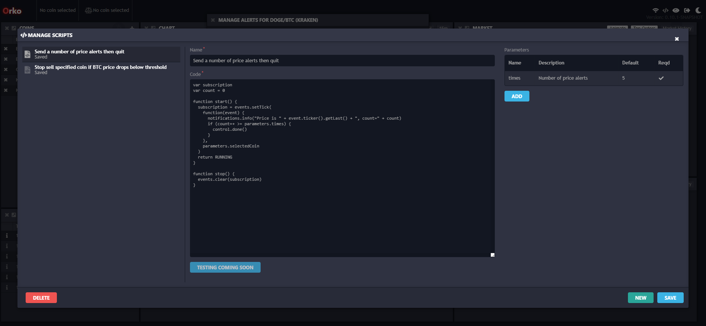
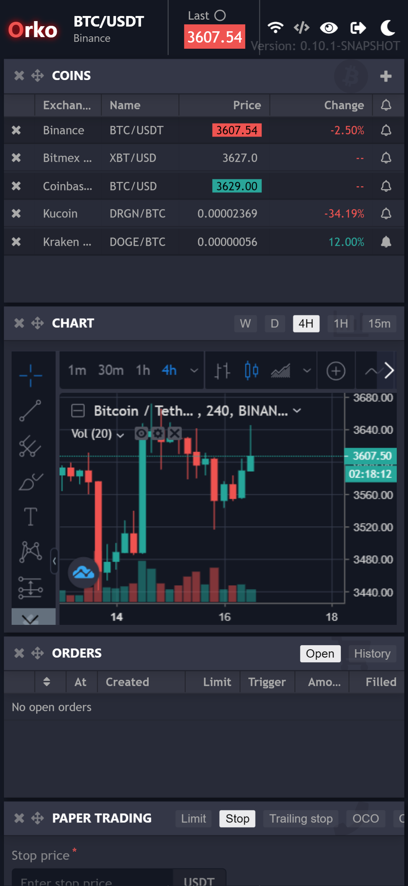

# Orko 

Fed up of logging into multiple separate cryptocurrency exchanges? Frustrated by missing features? Want to use advanced order types such as trailing stops on exchanges that don't support them?

Orko is a **self hosted** web application which provides a unified dashboard to control numerous cryptocurrency exchanges, allowing you to trade and manage your portfolio, even if it is spread across multiple exchanges, all from one screen. It works seamlessly on desktop and mobile, so you can have the same trading experience wherever you go.

All this without sharing your API keys with anyone.

Feel like creating your own special order types, such as soft stops, stops triggered off the price of a different asset, or a "Nuke" button which sells all your alt positions?  Orko features a [scripting](https://github.com/gruelbox/orko/wiki/Scripting) API allowing you to design your own bespoke order types.

Best of all, it's completely [free](https://www.fsf.org/about/what-is-free-software) (as in "free speech" as well as "free beer").  Read about some more [things it can do](https://github.com/gruelbox/orko/wiki/Example-Use-Cases).

## Status

**Beta**. Please read the [project status page](https://github.com/gruelbox/orko/wiki/Project-status). Particularly, please note that the application has only so far been tested on **Chrome desktop** and **Chrome mobile**.

Orko is a new application which has missing features and some well-known bugs. It needs your help. [Read more](https://github.com/gruelbox/orko/wiki/Why-Orko) about Orko, [why it's free](https://github.com/gruelbox/orko/wiki/Supporting_The_Project) and [how to help](https://github.com/gruelbox/orko/wiki/Project-status).

## Installation

[**Windows**](https://github.com/gruelbox/orko/wiki/Local-installation#on-windows) | [**Ubuntu/Debian**](https://github.com/gruelbox/orko/wiki/Local-installation#on-ubuntudebian) | [**Heroku (quick)**](https://github.com/gruelbox/orko/wiki/One-click-installation-on-Heroku) | [**Heroku (manual)**](https://github.com/gruelbox/orko/wiki/Manual-installation-on-Heroku)

## Demo

- **Address:** https://orko-demo.herokuapp.com/
- **Username:** trader1
- **Password:** givemeshitcoins
- **Second factor:** Leave blank

Paper trading only. Can take 30 seconds to spin up when accessed. Don't expect the full experience.

## Exchange Support

Orko does not do the following on any exchange: **deposits**, **withdrawals**, **funding** or **account management**. It is purely for trading.  [Margin trading](https://github.com/gruelbox/orko/issues/83) including position management is on the roadmap but not supported yet.

For exchange-specific support details, see the following table.

| Exchange | Support level | Missing trading features |Notes |
| -------- | ------------- | ---- | ----- |
| Binance  | Near perfect  | Dust conversion | Mostly as responsive, or more so, than the Binance website at trading. In particular, it is much more responsive during periods of high load, such as during a pump on BTC. |
| Bitfinex | Excellent     | True OCO trades, post only, reduce only, visibility of trades and positions on chart | Similar quality of experience to Binance, but more obviously short on features compared to Bitfinex's own site. |
| Coinbase Pro | Excellent | Post only, good-till-cancelled | Again, very good user experience, but with a few small UI glitches. |
| Bittrex | Working | **Streaming**, stop orders | Perfectly working for low frequency trading but not as smooth an experience. |
| Kraken | Minimal | **Streaming**, stop orders | As with Kucoin, with a few specific high-profile issues needing resolving. |
| Bitmex | Minimal | **Streaming**, most complex order types, balances, historical trades | Bare minimum for placing and cancelling simple limit trades and stops at your currently selected leverage. This has only just started to be implemented. |
| Kucoin | *Broken* | Everything except ticker, order book and market trades | Kucoin platform 2.0 has broken this. It's currently being fixed (see https://github.com/knowm/XChange/issues/2914) |

* **Streaming** = Websocket streaming updates. Most operations such as trades occur immediately but can take a short while to show in the UI. Without streaming, exchange data is fetched periodically instead. This is quick to implement in Orko but provides a less fluid user experience.  It is usually the first phase in implementing an exchange.

## Help wanted

At the moment this project is a labour of love for just me, I am creating new bug and enhancement issues faster than I am closing them, and I [need help](https://github.com/gruelbox/orko/issues/111)!

The **back-end server** is written in Java and is based on [XChange](https://github.com/knowm/XChange) and [xstream-stream](https://github.com/bitrich-info/xchange-stream), to which the project is a significant contributor. Please consider helping these great projects - it has a knock-on effect on Orko.

The **front-end UI** (mobile and desktop) is written in Javascript and is based on React+Redux.

## Everything else

See [the wiki](https://github.com/gruelbox/orko/wiki)!
